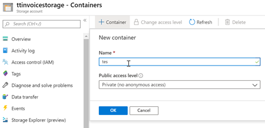
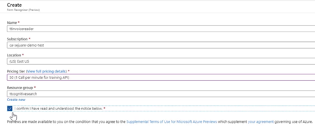

## Demo 2 - Using Form Recognizer

## Summary
In this exercise we learn how to use the Form Recognizer service. It is assumed that a storage account has been created (as described in the [first demo](demo1.md).)

## What you need
- [Invoice Training Set](https://globaleventcdn.blob.core.windows.net/assets/aiml/aiml10/data/train.zip)

- Access to the limited-access preview. To get access to the preview, fill out and submit the [Form Recognizer access request](https://aka.ms/FormRecognizerRequestAccess) form.

- [Postman](https://www.getpostman.com/) is used to send requests to the Form Recognizer service REST API.

- Postman Form Recognizer requests [collection](src/Collections/Form_Recognizer.postman_collection.json).

## Azure Resources
The only resource we work with in this demonstration is the Form Recognizer service.

| Name                       | Type                            | Purpose                    |
| -------------------------- | ------------------------------- | ------------------------- |
| **ttinvoicereader**       | Form Recognizer Service         | This service will eventually end up in the All-In-One sevice. For right now it is in limited-access preview. To get access to the preview, fill out and submit the [Form Recognizer access request](https://aka.ms/FormRecognizerRequestAccess) form.  |

## What to do

There are three main steps:
1. Upload training data to the storage account
2. Create Form Recognizer service
3. Train and Use Form Recognizer service

### Upload Training Data

1. Create a container called `train` in the storage account created in the previous demo.

2. Download and unzip [invoice training set](https://globaleventcdn.blob.core.windows.net/assets/aiml/aiml10/data/train.zip).

3. Upload unzipped [invoice training set](https://globaleventcdn.blob.core.windows.net/assets/aiml/aiml10/data/train.zip) to the `train` container. This can be done directly using the [portal](https://docs.microsoft.com/en-us/azure/storage/blobs/storage-quickstart-blobs-portal?WT.mc_id=msignitethetour2019-github-aiml10#upload-a-block-blob) or by using the [Azure Storage Explorer](https://docs.microsoft.com/en-us/azure/vs-azure-tools-storage-explorer-blobs?WT.mc_id=msignitethetour2019-github-aiml10) application (as shown in the [video](https://globaleventcdn.blob.core.windows.net/assets/aiml/aiml10/videos/Demo2.mp4 "Demo 1")).

### Create Form Recognizer service

In order to do this you must have access to the Form Recognizer preview. To get access to the preview, fill out and submit the [Form Recognizer access request](https://aka.ms/FormRecognizerRequestAccess) form. 

1. Create the Form Recognizer service using the special access link.

