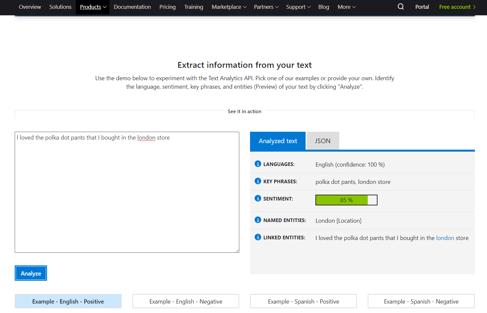

# AIML40 - Taking Models to the Next Level with Azure Machine Learning Best Practices

## Session information

Artificial Intelligence and Machine Learning can be used in many ways to increase productivity of business processes and gather meaningful insights, by analyzing images, texts and trends within unstructured flows of data. While many tasks can be solved using existing models, in some cases it is also required to train your own model for more specific tasks, or for increased accuracy. 

In this session, we will explore the complete path of integrating text analysis intelligent services into the business processes of [Tailwind Traders](http://tailwindtraders.com), starting from pre-build models available as [cognitive services](https://azure.microsoft.com/services/cognitive-services/?WT.mc_id=msignitethetour2019-github-aiml40), up to training a third-party neural custom model for [Aspect-Based Sentiment Analysis](https://www.intel.ai/introducing-aspect-based-sentiment-analysis-in-nlp-architect/) availabe as part of [Intel NLP Architect](http://nlp_architect.nervanasys.com/) using [Azure Machine Learning Service](https://azure.microsoft.com/services/machine-learning-service/?wt.mc_id=msignitethetour2019-github-aiml40). We will talk about cases when one needs a custom model, and demonstrate quick ways to create such a model from scratch using [AutoML](https://docs.microsoft.com/azure/machine-learning/service/concept-automated-ml/?wt.mc_id=msignitethetour2019-github-aiml40), and show how to fine-tune model hyperparameters using [HyperDrive](https://docs.microsoft.com/azure/machine-learning/service/how-to-tune-hyperparameters/?wt.mc_id=msignitethetour2019-github-aiml40)

## Delivery assets

The following asset can be used for delivering this talk:

- [PowerPoint deck]()
- [Demonstration videos]()

## Overview of Demonstrations

In this presentation, the following demonstrations are made:

1. Using [Cognitive Services Text Analytics](https://azure.microsoft.com/services/cognitive-services/text-analytics/?wt.mc_id=msignitethetour2019-github-aiml40) to find out the sentiment of a restaurant review
2. Using [Azure AutoML](https://docs.microsoft.com/azure/machine-learning/service/concept-automated-ml/?wt.mc_id=msignitethetour2019-github-aiml40) to build a text classifier almost with no code
3. Using [Azure Machine Learning Service](https://azure.microsoft.com/services/machine-learning-service/?wt.mc_id=msignitethetour2019-github-aiml40) to train Aspect-Based Sentiment Analysis model on Azure Cluster.

## Starting Fast

If you want to start right away, you can deploy all required resources via Azure Template, and open the code in Azure Notebooks. 

<a href="https://portal.azure.com/#create/Microsoft.Template/uri/https%3A%2F%2Fraw.githubusercontent.com%2Fmicrosoft%2Fignite-learning-paths%2Fmaster%2Faiml%2Faiml40%2Ftemplate%2Fazuredeploy.json" target="_blank">
 
</a>
<!-- TODO: provide correct Azure Notebook path -->
<a href="https://notebooks.azure.com/sosh/projects/ignite-absa"></a>

Below we provide more detailed instructions for the demo, in case you want to make most of the steps manually to fully understand the concepts.

## Initial Environment Setup

In order to perform steps 2 and 3 of the demo, we would need to:

1. Create an Azure Machine Learning Workspace
2. Upload the [data used for AutoML training]().  <!-- TODO -->

#### Creating Azure Machine Learning Workspace

Azure ML Workspace can be either created manually from [Azure Portal](http://portal.azure.com/?wt.mc_id=msignitethetour2019-github-aiml40) ([here is the complete walkthrough](https://docs.microsoft.com/azure/machine-learning/service/how-to-manage-workspace/?wt.mc_id=msignitethetour2019-github-aiml40)), deployed from Azure Template, or created through [Azure CLI](https://docs.microsoft.com/ru-ru/cli/azure/?view=azure-cli-latest&wt.mc_id=msignitethetour2019-github-aiml40) (we are using `absa` as a name, and *West US 2* datacenter in this example, but feel free to change that):

```shell
az extension add -n azure-cli-ml
az group create -n absa -l westus2
az ml workspace create -w absa_space -g absa
```

You would also need to know your subscription id, which can be obtained by running `az account list`.

#### Uploading data to the workspace

In our demo, we use two datasets:
* A dataset for AutoML demo (still in consideration) <!-- TODO -->
* [Tripadvisor Dataset](https://github.com/NervanaSystems/nlp-architect/blob/master/datasets/absa/tripadvisor_co_uk-travel_restaurant_reviews_sample_2000_train.csv) from NLP Architect

To follow AutoML Demo, please upload the dataset to your workspace. You can do it manually through [Azure ML Portal](http://ml.azure.com/?wt.mc_id=msignitethetour2019-github-aiml40), or use the provided file `upload_dataset.py` (csv file should be in the current directory, and you should substitute `[subscription_id]` according to your subscription):

```shell
python upload_dataset.py -s [subscription_id] -w absa_space -g absa -f dataset.csv
```

The Tripadvisor dataset would be uploaded to datastore by the demo code.

#### Using the Azure ML Demo Code

You can execute demo code from any Jupyter Notebook Environment. You can:
 - Install Python environment locally, as described below in **Python Environment Installation**
 - Use [Azure Notebooks](https://docs.microsoft.com/ru-ru/azure/notebooks/azure-notebooks-overview/?wt.mc_id=absa-notebook-abornst). In this case you should upload the `absa.ipynb` file to a new Azure Notebooks project, or just clone the [notebook library](https://notebooks.azure.com/sosh/projects/ignite-absa).
 <!-- TODO: provide final path to notebook library -->

#### Python Environment Installation

If you decide not to use Azure Notebooks, and prefer to use your local Python environment, you need to install the Python Azure ML SDK, and make sure to install notebook and contrib:

```shell
conda create -n azureml -y Python=3.6
source activate azureml
pip install --upgrade azureml-sdk[notebooks,contrib] 
conda install ipywidgets
jupyter nbextension install --py --user azureml.widgets
jupyter nbextension enable azureml.widgets --user --py
```

You will need to restart jupyter after this Detailed instructions are [here](https://docs.microsoft.com/azure/machine-learning/service/quickstart-create-workspace-with-python/?WT.mc_id=msignitethetour2019-github-aiml40)

If you need a free trial account to get started you can get one [here](https://azure.microsoft.com/offers/ms-azr-0044p/?WT.mc_id=msignitethetour2019-github-aiml40)

Demo code, snippets, instruction, and notes 
Setup (automatic/ partially automatic / manual) procedure 
Tear down (automatic/ partially automatic / manual) procedure 
Train-the-Trainer materials 
List of all the Certified Speakers 

#### Pre-creating Compute Cluster

For the last two demos, we would need a compute cluster. For demo purposes, we will create a cluster that consists of one node only. This can be done in one of three ways:

1. Through [Azure ML Portal](http://ml.azure.com/?wt.mc_id=msignitethetour2019-github-aiml40) go to **Compute** section and manually create Azure ML Compute cluster with *Standard_DS3_v2* VMs, specifying number of nodes = 1. Name the cluster `absa-cluster`.
2. Run the provided `create_cluster.py` script, providing parameters as above:
```shell
python create_cluster.py -s [subscription_id] -w absa_space -g absa
```
3. Run first few cells from `absa.ipynb` notebook, which create the cluster for you.

## Demos

### Demo 1: Text Analytics Cognitive Service

In this demo, we show how Text Analytics can do sentiment analysis of a phrase in a web interface.

1. Open [Text Analytics Page](https://azure.microsoft.com/services/cognitive-services/text-analytics/?WT.mc_id=msignitethetour2019-github-aiml40)
2. Scroll down to **see it in action** section and enter the phrase *The food was very fresh and flavoursome the service was very attentive. Would go back to this restaurant if visiting London again.* (You can also leave the default phrase to demonstrate the point).
3. Press **Analyze** to get the following result:



Note that Text Analytics does not only provide sentiment, but also extracts location and key words from text.

### Demo 2: Azure AutoML

In this demo, we demonstrate how AutoML can be used to build ML model without coding.

1. Navigate to your Azure ML Workspace (created above) in the [http://ml.azure.com](http://ml.azure.com/?WT.mc_id=msignitethetour2019-github-aiml40)
2. Go to **Datasets** - you should see the previously uplodaded dataset there. Note that you can also upload it here through the portal.
3. Select the dataset.
4. From the **Overview** tab, expand **Sample usage** and show the code that can be used to access the data programmatically, if needed.
5. From the **Explore** tab, have a look at the data.
6. Go to **Automated ML** tab and click **New Experiment**
7. Select experiment name and compute to be used.
8. Select the dataset.
9. Select those fields that are important for ML model to train on. You should unselect all fields except for **text**.
10. Chose the type of prediction task -- **Classification**.
11. Select target column -- **Stars**.
12. Click **Start**.

The experiment will take quite a long time to run, because different algorithms will be investigated. If showing a demo, it would make sense to run this in advance and just show the results.

### Demo 3: Using Azure ML Workspace with Python SDK

In this demo, we will run custom Python code that uses Python Azure ML SDK to train, optimize and use the custom ABSA model.

All of the instructions for this part of the demo are located in the Jupyter Notebook itself. Use one of the methods described above to run the Notebook (in Azure Notebooks, or locally), and follow instructions there. 

## Tear Down

To free up cloud resources used during the demo, you need to delete Azure ML workspace and resource group:

```shell
az ml workspace delete --w absa_space -g absa
az group delete -n absa
```

## Resources and Continue Learning

Here is a list of related training and documentation.

- [9 Advanced Tips for Production Machine Learning](aka.ms/9TipsProdML)
- [Microsoft Samples for Natural Language Processing](https://github.com/microsoft/nlp/)
- [Intel Aspect-Based Sentiment Analysis Page](https://www.intel.ai/introducing-aspect-based-sentiment-analysis-in-nlp-architect/)

## Feedback loop

Do you have a comment, feedback, suggestion? Currently, the best feedback loop for content changes/suggestions/feedback is to create a new issue on this GitHub repository. To get all the details about how to create an issue please refer to the [Contributing](../../contributing.md) docs
