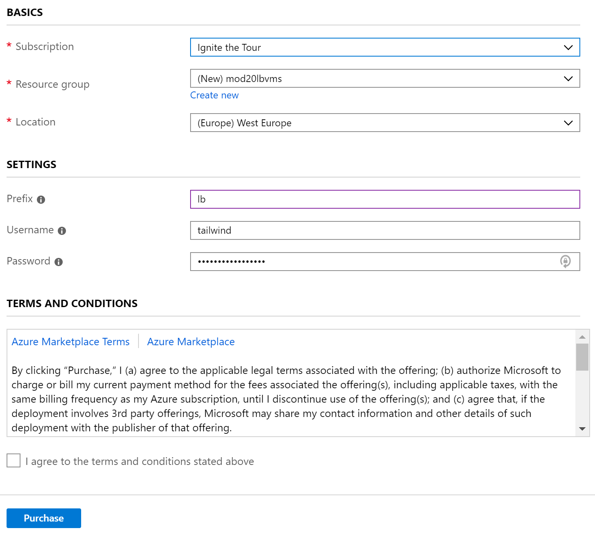

# Deploying the Azure services (PaaS, website, Cosmos, Azure SQL, DMS)

In order to install the other Azure services that will be used during the demos, follow these steps:

## I. Click on the button below to open the deployment page.

## II. In the template page, enter the following information:

- Subscription: Select the subscription in which the resources should be deployed.
    
- Resource group: Create a new resource group. Try to name it consistently, for example we recommend `mod20[prefix]paas` where `[prefix]` is the unique prefix that you [prepared here](./01-preparation.md/#prefix).
    
- Location: Enter [the location that you selected](./01-preparation.md/#location) for this session's demos, for example `East US 2` or `West Europe`.

- Prefix: The **unique prefix** [that you prepared](./01-preparation.md/#prefix) for to render the resources names unique.

> IMPORTANT: Because of some limitations in some services' names, the prefix should be **4 characters long maximum**. You should only use **the letters A-Z, a-z or the digits 0-9** for the prefix.

- Username: The [username that you prepared](./01-preparation.md/#credentials), that will be used to log into the virtual machines. We recommend sticking to a consistent username and password. For convenience, this field is pre-populated with the value `tailwind` but you can change it if you want.

- Password: The [password that you prepared](./01-preparation.md/#credentials), that will be used to log into the virtual machines. We recommend sticking to a consistent username and password. For convenience, this field is pre-populated with the value `traderstraders42.` but you can change it if you want.

After you entered the values, check the `Terms and conditions` checkbox and click on Purchase.

> Depending on a number of factors, the deployment should take about XX minutes.

> **TODO**
> - Update the number of minutes needed for the deployment.
> - Enter a description of steps needed to verify the deployment while it is running.

## III. Finish the deployment

[Click here](./04-prep-finish.md) and follow the instructions to finish the deployment.