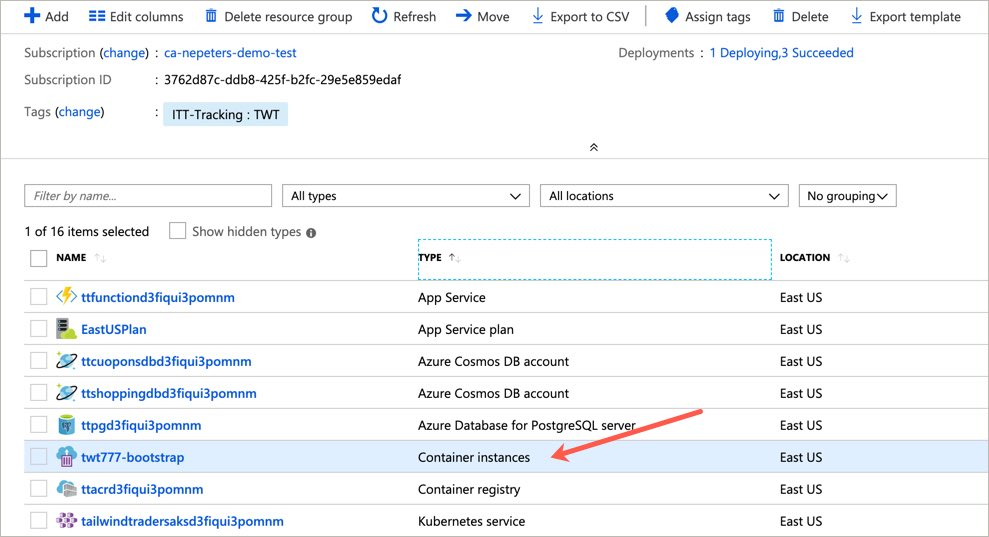
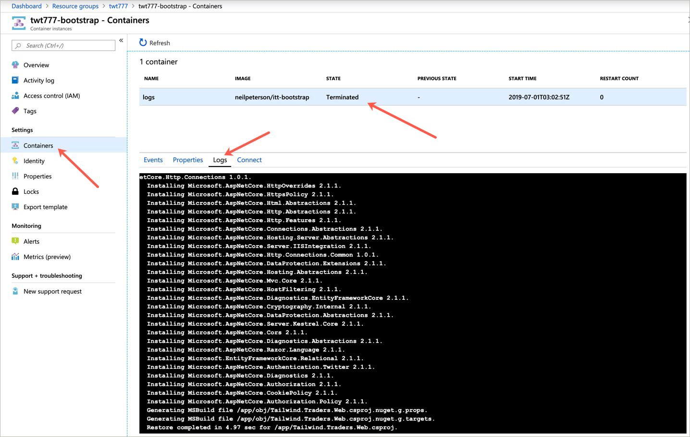
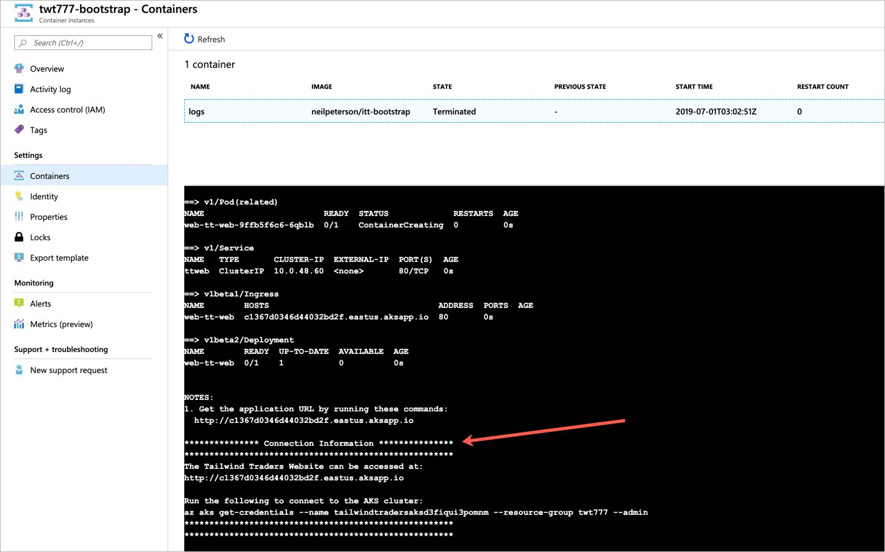

# Tailwind OPS LP Deployment

## Provider registration

The Tailwind Traders application uses many Azure services. In some cases, if a service has not yet been used in your subscription, a provider registration may be needed. The following commands will ensure your subscription is capable of running the Tailwind Traders application.

```
az provider register --namespace Microsoft.OperationalInsights
az provider register --namespace Microsoft.DocumentDB
az provider register --namespace Microsoft.DBforPostgreSQL
az provider register --namespace Microsoft.OperationsManagement
az provider register --namespace Microsoft.ContainerService
az provider register --namespace Microsoft.Sql
az provider register --namespace Microsoft.ContainerRegistry
```

## Deployment

<a href="https://portal.azure.com/#create/Microsoft.Template/uri/https%3A%2F%2Fraw.githubusercontent.com%2Fmicrosoft%2Fignite-learning-paths%2Fmaster%2Fops%2Fdeployment%2Fazuredeploy.json" target="_blank">
 
</a>

## Connect to deployment

To validate that the deployment has completed, select the Azure Container Instance.



Select **Containers**. Once the container state has changed from **Running** to **Terminated**, the deployment automation has completed. Select logs.



Scroll to the bottom of the logs to retrieve both the application URL and the command needed to connect to the Kubernetes cluster.

