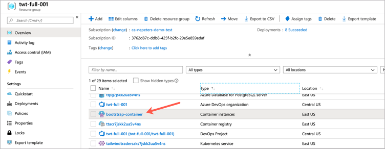
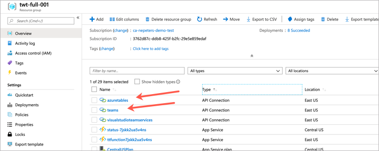
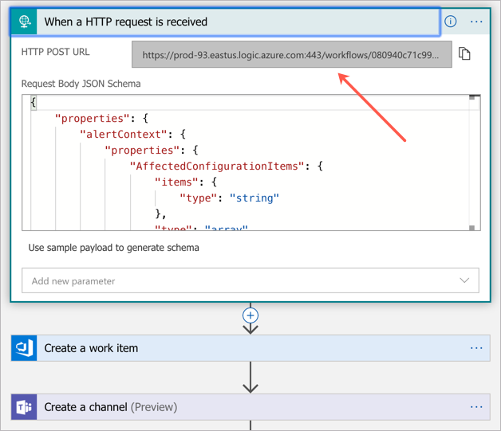
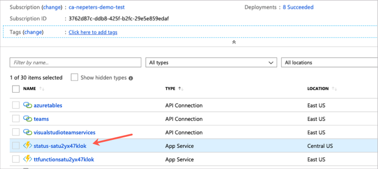
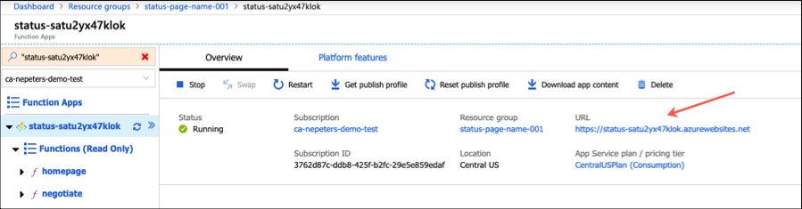

# OPS Learning Path Template (dev)

Templates will be used for OPS10 - OPS40.

<a href="https://portal.azure.com/#create/Microsoft.Template/uri/https%3A%2F%2Fraw.githubusercontent.com%2Fmicrosoft%2Fignite-learning-paths%2Fmaster%2Fops%2Fdeployment%2Fazuredeploy.json" target="_blank">
 
</a>

## Browse to the Tailwind website

The Tailwind website is hosted on a Kubernetes cluster behind an Ingress controller. To get the address of the Ingress controller:

Select the Bootstrap Azure Container Instance



Select Containers > Logs > and scroll to the bottom of the logs. The Ingress controller address is in the logs.

## Connect to the Tailwind AKS cluster

The command to connect to the AKS Cluster is also in the bootstrapping logs. Alternatively, run the following command to find all AKS clusters in your subscription.

```
az aks list -o table
```

Run this command to connect to the cluster. Replace the cluster name and resource group with those from your deployment.

```
az aks get-credentials --name tailwindtradersaks7jskk2ua5v4ns --resource-group twt-full-001 --admin
```

## Trigger the OPS20 incident logic app

First, the `teams` and `visualstudioteamsservices` API connections need to be authenticated. Click on each and follow the onscreen prompts.



Next, edit the logic app named `ops20main`, select the first task, and copy out the trigger URL.



Use postman or other tool to send a request to the logic app HTTP trigger. Include the following body.

```
{
    "alertContext": {
        "SearchQuery": "search * \n| where Type == \"Heartbeat\" \n| where Category == \"Direct Agent\" \n| where TimeGenerated > ago(30m) ",
        "SearchIntervalStartTimeUtc": "3/22/2019 1:36:31 PM",
        "SearchIntervalEndtimeUtc": "3/22/2019 1:51:31 PM",
        "ResultCount": 15,
        "LinkToSearchResults": "https://portal.azure.com#@72f988bf-86f1-41af-91ab-2d7cd011db47/blade/Microsoft_OperationsManagementSuite_Workspace/AnalyticsBlade/initiator/AnalyticsShareLinkToQuery/isQueryEditorVisible/true/scope/%7B%22resources%22%3A%5B%7B%22resourceId%22%3A%22%2Fsubscriptions%<subscription ID>%2FresourceGroups%2Fpipelinealertrg%2Fproviders%2FMicrosoft.OperationalInsights%2Fworkspaces%2FINC-OmsAlertRunner%22%7D%5D%7D/query/search%20%2A%20%0A%7C%20where%20Type%20%3D%3D%20%22Heartbeat%22%20%0A%7C%20where%20Category%20%3D%3D%20%22Direct%20Agent%22%20%0A%7C%20where%20TimeGenerated%20%3E%20%28datetime%282019-03-22T13%3A51%3A31.0000000%29%20-%2030m%29%20%20/isQuerybase64Compressed/false/timespanInIsoFormat/2019-03-22T13%3a36%3a31.0000000Z%2f2019-03-22T13%3a51%3a31.0000000Z",
        "SeverityDescription": "Critical",
        "WorkspaceId": "2a1f50a7-ef97-420c-9d14-938e77c2a929",
        "SearchIntervalDurationMin": "15",
        "AffectedConfigurationItems": [
            "INC-Gen2Alert"
        ],
        "SearchIntervalInMinutes": "15",
        "Threshold": 10000,
        "Operator": "Less Than",
        "SearchResult": {
            "tables": [{
                "name": "PrimaryResult",
                "columns": [{
                        "name": "$table",
                        "type": "string"
                    },
                    {
                        "name": "Id",
                        "type": "string"
                    },
                    {
                        "name": "TimeGenerated",
                        "type": "datetime"
                    }
                ],
                "rows": [
                    [
                        "Fabrikam",
                        "33446677a",
                        "2018-02-02T15:03:12.18Z"
                    ],
                    [
                        "Tailwind Traders",
                        "33445566b",
                        "2018-02-02T15:16:53.932Z"
                    ]
                ]
            }],
            "dataSources": [{
                "resourceId": "/subscriptions/a5ea27e2-7482-49ba-90b3-60e7496dd873/resourcegroups/nrt-tip-kc/providers/microsoft.operationalinsights/workspaces/nrt-tip-kc",
                "tables": [
                    "Heartbeat"
                ]
            }]
        },
        "IncludedSearchResults": "True",
        "AlertType": "High Number of Failures"
    }
}
```

## Browse to the OPS20 Status Page

Find the App Service with a name like `status-` and then a random string.



The Tailwind status page can be reached at the App Service URL.



## How is this deployment structured

```
azuredeploy.json: parameter value intake and calls all linked deployments
    |_azuredeploy-tailwind.json: deploys an AKS cluster and other infrastructure needed for Tailwind
    |_azuredeploy-azd.json: deploys an Azure DevOps organization and project
    |_azuredeploy-logic-apps.json: deploys the OPS20 logic apps and api connections
    |_azuredeploy-status.json: deploys the OPS20 status page
    |_deploy.sh: runs apps on Kubernetes and some other post-processing items
        |_azure-table.py: Adds the OPS20 `oncall` and `statuses` table
```
