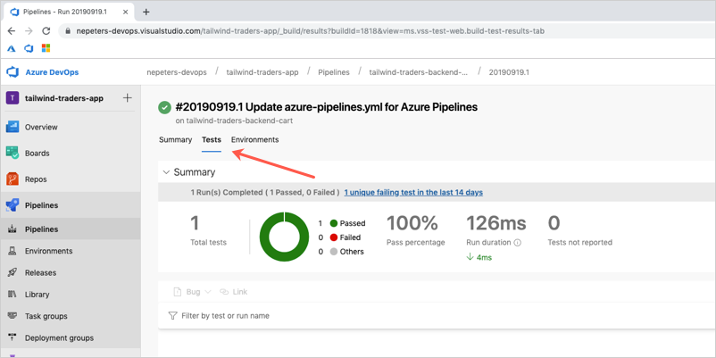

# Deployment Practices for Greater Reliability

Infrastructure and software delivery methods have a direct and material impact on reliability. Manual service deployment and provisioning is slow, error-prone, and can result in incidents. Using modern continuous deployment practices and provisioning methods can reduce overhead while preventing incidents before they happen.

In this session, we will see how continuous delivery pipelines have helped Tailwind Traders and the rest of the industry deploy tested software to production environments to increase reliability. We’ll also explore modern methods for environment provisioning using infrastructure as code. As a result of attending this session, you will gain practical information on automated deployment and provisioning solutions using Azure-based technology.

## Demo environment deployment

The following deployment produces the Tailwind application + and Azure DevOps instance for the OPS40 demos. You need two of these deployment for OPS40, one pre-production and the other a production environment.

<a href="https://portal.azure.com/#create/Microsoft.Template/uri/https%3A%2F%2Fraw.githubusercontent.com%2Fmicrosoft%2Fignite-learning-paths%2Fmaster%2Fops%2Fdeployment%2Fazuredeploy.json" target="_blank">
 
</a>

Once completed, fork the following repo to your own GitHub account.

https://github.com/microsoft/TailwindTraders-Backend

Clone the repo to your development system and add the [azure-pipelines.yml](demos/azure_pipeline/azure-pipelines.yml) file to the `/Source/Services/Tailwind.Traders.Cart.Api` directory.

Update the `azure-pipeline.yml' file with the appropritae variabel values (AKS cluster and ACR Registry). To find the AKS values run:

```
az aks list -o table
```

To find the ingress value, once connected to the AKS cluster, run:

```
kubectl get ingress
```

To find the ACR values run:

```
az acr list -o table
```

Finally, run the pipeline to validate functionality

## Delivery assets

The following asset can be used for delivering this talk:

- [PowerPoint deck]()
- [Demonstration videos]()

## Demo 1 - Azure DevOps

**Part 1:** Pipeline Overview

Open up the cart pipeline, and detail the following:

- [Stages](https://docs.microsoft.com/en-us/azure/devops/pipelines/process/stages?view=azure-devops&tabs=yaml)
- [Jobs](https://docs.microsoft.com/en-us/azure/devops/pipelines/process/phases?view=azure-devops&tabs=yaml)
- [Trigger](https://docs.microsoft.com/en-us/azure/devops/pipelines/build/triggers?view=azure-devops&tabs=yaml)
- [Path filter](https://docs.microsoft.com/en-us/azure/devops/pipelines/build/triggers?view=azure-devops&tabs=yaml#paths)
- [Pull request trigger](https://docs.microsoft.com/en-us/azure/devops/pipelines/build/triggers?view=azure-devops&tabs=yaml#pr-triggers)
- [Variables](https://docs.microsoft.com/en-us/azure/devops/pipelines/process/variables?view=azure-devops&tabs=yaml%2Cbatch)
- [Variable groups](https://docs.microsoft.com/en-us/azure/devops/pipelines/library/variable-groups?view=azure-devops&tabs=yaml)
- [Conditions](https://docs.microsoft.com/en-us/azure/devops/pipelines/process/conditions?view=azure-devops&tabs=yaml)
- [Tasks](https://docs.microsoft.com/en-us/azure/devops/pipelines/process/tasks?view=azure-devops&tabs=yaml)

**Part 2:** Production Reconciliation

Show how production can be reconciled .via build ID (helm release version and container image version).

Get the latest build id, this can be seen in the last runs URL.


Navigate back to the pipeline and show how the built-in `Build.BuildId` variable can be used as a task value.

```
- task: HelmDeploy@0
  displayName: 'helm package (tt-cart)'
  inputs:
    command: package
    chartPath: 'Deploy/helm/cart-api'
    arguments: '--version $(Build.BuildId)'
```

Return a list of helm release, and show that the chart used to release the `CHART` has a version that matches the build id.

```
$ helm list

NAME                    REVISION        UPDATED                         STATUS          CHART                           NAMESPACE
my-tt-cart              2               Wed Sep 18 21:18:46 2019        DEPLOYED        cart-api-1818                   default
```

Return a list of pods to get the name of the cart pod.

```
$ kubectl get pods

my-tt-cart-cart-api-77db6f9f58-wqs7p                        1/1     Running   0          11h
my-tt-coupon-tt-coupons-85c96964fc-z7tc7                    1/1     Running   0          15h
my-tt-image-classifier-7d6d97875f-4z66s                     1/1     Running   0          15h
my-tt-login-7f88cff49-fqk95                                 1/1     Running   0          15h
my-tt-mobilebff-67dcb9f988-7vgc9                            1/1     Running   0          15h
my-tt-popular-product-tt-popularproducts-67dfcc8b67-f7knj   1/1     Running   0          15h
my-tt-product-tt-products-d9c54d955-6fmd8                   1/1     Running   0          15h
my-tt-profile-5c57bf89b4-5z79c                              1/1     Running   0          15h
my-tt-stock-6b969dd459-hw559                                1/1     Running   0          15h
my-tt-webbff-67849c78b7-qhvlg                               1/1     Running   0          15h
web-6b56cc7d7c-w7t9x                                        1/1     Running   0          15h
```

Describe the cart pod to see the Docker image used to start it. Note that the image version matches the Build ID.

```
$ kubectl describe pod my-tt-cart-cart-api-77db6f9f58-wqs7p

Containers:
  cart-api:
    Container ID:   docker://9438c601b838855659abef2f68ab19c281bd172525ce09aedbbcf65dc0940580
    Image:          ttacr5iny4v2wygm3k.azurecr.io/cart.api:1818
```

**Part 2:** Add Unit Test

Add the following stage to the pipeline, click save, which will start a new run.

```
- stage: test
  jobs:
  - job:

    variables:
      hostDB: https://ttshoppingdbxy4tce6fzj25s.documents.azure.com:443/

    pool:
      name: Hosted Ubuntu 1604

    steps:

    - task: PowerShell@2
      displayName: Install Pester
      inputs:
        targetType: 'inline'
        script: |
          Find-Module pester | Install-Module -Force

    - task: AzureCLI@1
      displayName: Generate values file for test
      inputs:
        azureSubscription: 'nepeters-azure'
        scriptLocation: 'inlineScript'
        inlineScript: |
          pwsh Deploy/Generate-Config.ps1 -resourceGroup $(aks-cluster-rg-pre-prod) -sqlPwd Password2020! -gvaluesTemplate Deploy/helm/gvalues.template -outputFile ./values.yaml

    - task: PowerShell@2
      displayName: Parse host name
      inputs:
        targetType: 'inline'
        script: |
          $content = Get-Content values.yaml
          $hostName = $content[37].split(" ")[7]

    - task: PowerShell@2
      displayName: Run Pester tests
      inputs:
        targetType: 'inline'
        script: 'invoke-pester -Script @{ Path = ''./tests/''; Parameters = @{ hostName = ''$(hostDB)'' }} -OutputFile "./test-results.xml" -OutputFormat ''NUnitXML'''

    - task: PublishTestResults@2
      displayName: Publish test results
      inputs:
        testResultsFormat: 'NUnit'
        testResultsFiles: '**/test-results.xml'
        failTaskOnFailedTests: true
```

While the run is in progress show the following.

- Pipeline logs
- [Azure Pipeline YAML reference](https://docs.microsoft.com/en-us/azure/devops/pipelines/yaml-schema?view=azure-devops&tabs=schema)

Once the testing stage has completed, show the test results.



## Demo 2 - Azure Resource Manager templates

In this demo, an Azure Resource Manager template is examined, updated, and deployed.

### Examine a simple template

A simple template named `simple-tempalte.json` can be found under the demos directory. Take a quick walk through the template, highlighting these items.

- The four sections of the template [(parameters, variables, resources, and outputs](https://docs.microsoft.com/en-us/azure/azure-resource-manager/resource-group-authoring-templates)

### Deploy more complex template

A more complex template named `azuredeploy.json` can also be found in the demos directory.

First, show the already created Tailwind Traders resources in the Azure portal.

Deploy the template with the following command making sure that the resource group names match.

```
az group deployment create --resource-group tailwind-production --template-file ops/ops40/demos/arm_template/azuredeploy.json
```

Open up the Azure portal and show that the deployment is occurring and that the only affected resource is the storage account being added.

## Teardown instructions

When done the demo environment can be deleted using the following command:

```
az group delete --name <resource group name> --yes --no-wait
```

## Resources and Continue Learning

Here is a list of related training and documentation.

- [Design for availability and recoverability in Azure](https://docs.microsoft.com/en-us/learn/modules/design-for-availability-and-recoverability-in-azure/?WT_mc_id=msignitethetour2019-slides-ops40)
- [Create a build pipeline](https://docs.microsoft.com/en-us/learn/modules/create-a-build-pipeline/?WT_mc_id=msignitethetour2019-slides-ops40)

## Feedback loop

Do you have a comment, feedback, suggestion? Currently, the best feedback loop for content changes/suggestions/feedback is to create a new issue on this GitHub repository. To get all the details about how to create an issue please refer to the [Contributing](../../contributing.md) docs